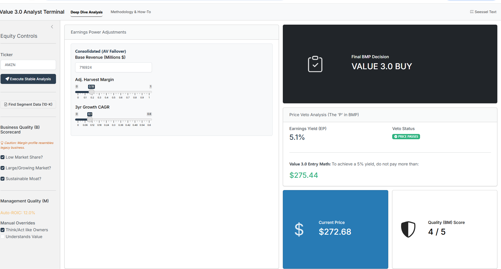

# Value 3.0 Analyst Terminal 📈

An automated equity analysis platform built in **R Shiny**, based on the "Value 3.0" methodology established by Adam Seessel in his book, *Where the Money Is: Value Investing in the Digital Age*.

## 📖 Methodology Overview
This terminal moves beyond traditional value investing metrics (Value 1.0/2.0) to evaluate modern digital enterprises. It follows the **BMP (Business, Management, Price)** framework:

*   **Business (B):** Identifies "Toll Bridge" businesses with high switching costs and massive market opportunities.
*   **Management (M):** Evaluates capital allocation efficiency via Return on Invested Capital (ROIC) and owner-oriented mindsets.
*   **Price (P):** Applies the "Lincoln Cabinet" Veto. We calculate **Earnings Power** by adding back R&D/Marketing spend and rolling revenue 3 years forward. If the resulting yield is below **5%**, the investment is vetoed regardless of quality.

## 🚀 Key Features
- **Segmented Earnings Power:** Unpacks complex corporate structures (e.g., AWS vs. Retail) to find hidden profitability.
- **Multi-API Failover:** Integrated with **Financial Modeling Prep (FMP)**, **Alpha Vantage**, and **Tiingo** for high-resolution fundamental and market data.
- **Analyst Intelligence Layer:** Automatically suggests qualitative scores based on financial proxies (Revenue CAGR, Gross Margins, and ROIC).
- **Manual Override Mode:** High-precision research capability allowing users to input data directly from SEC 10-K filings when API limits are reached.
- **Interactive Veto Math:** Real-time calculation of "Maximum Buy Price" to achieve a 5% entry yield.
To use the **Value 3.0 Terminal** effectively, you must transition from being a "Financial Analyst" (who looks at what the company *spent*) to a "Business Analyst" (who looks at what the company *is*).

Below is a guide on how to set your sliders for the three categories of companies, using the rationale strictly derived from Chapters 8 and 9 of **"Where the Money Is."**

## 🧭 Use Case Analysis

### Case Example 1: The Digital "Toll Bridge" (Pure Software)
**Relevant Tickers:** `INTU` (Intuit), `MSFT` (Microsoft), `ADBE` (Adobe), `GOOGL` (Alphabet)

*   **Rationale:** These companies have nearly zero marginal costs. Once the code is written, selling one more unit costs nothing. They look expensive because they spend 20-40% of revenue on R&D to stay ahead.
*   **The Adjustment:**
    *   **Harvest Margin (40% - 50%):** Seessel notes on **Page 80** that mature software companies like Oracle operate at 50% margins because they aren't "planting new seeds." For Intuit, he explicitly uses a **40% margin** proxy (**Page 158**) to calculate its real earnings power.
    *   **3yr Growth CAGR (15% - 25%):** Look for "Escape Velocity." If the company has a low market share of a massive market (like Intuit reaching only 2% of potential customers—**Page 157**), assume high double-digit growth.

### Case Example 2: High IP / Specialized Industrial
**Relevant Tickers:** `NVDA` (Nvidia), `HEICO` (Heico Corp), `ASML` (ASML Holding)

*   **Rationale:** These aren't "pure" digital plays because they make physical things, but they are protected by **Switching Costs** and **Technical Trust**. HEICO’s parts must be blessed by the FAA (**Page 71**); engineers won't switch to a competitor to save a few dollars if it risks a crash.
*   **The Adjustment:**
    *   **Harvest Margin (25% - 35%):** These companies have higher costs of goods than software. However, they are still "IP Engines." For HEICO, the return on capital is high, but margins are lower than software. Start at **25%** and move up if the 10-K shows massive R&D that could be "turned off."
    *   **3yr Growth CAGR (10% - 20%):** Seessel models HEICO with a 30-year track record of ~20% growth (**Page 72**). For a company like Nvidia, use a higher CAGR (**25%+**) during an AI infrastructure build-out, but decelerate it for the "Value 3.0 Margin of Safety."

### Case Example 3: The Legacy Giant (Value 2.0)
**Relevant Tickers:** `COST` (Costco), `KO` (Coca-Cola), `WMT` (Walmart)

*   **Rationale:** These are "Value 2.0" companies (**Chapter 3**). Their business models are mature, and their markets are largely saturated. They are *already* in harvest mode.
*   **The Adjustment:**
    *   **Harvest Margin (8% - 15%):** There is very little "hidden profit" here. Walmart operates at a ~6% margin (**Page 133**). For Costco, do not use the software 40% proxy; stay close to their **reported GAAP margins**, perhaps adding back only 1-2% for marketing.
    *   **3yr Growth CAGR (3% - 7%):** These companies grow in line with GDP. Seessel warns that the "Digital Divide" is hollowing out these businesses (**Page 16**). Unless they have a specific digital catalyst, keep this slider low.

---

### Summary Guideline Table for your Terminal

| Company Type | Harvest Margin Slider | 3yr CAGR Slider | Rationale |
| :--- | :--- | :--- | :--- |
| **Pure Digital** | **0.40 - 0.55** | **15% - 30%** | High R&D "penalizes" GAAP; massive market "white space." |
| **High IP** | **0.25 - 0.35** | **12% - 20%** | Technical moats allow high margins but higher COGS than software. |
| **Legacy/Retail** | **0.05 - 0.12** | **2% - 8%** | Already harvesting; growth is limited by physical footprint. |

## 🛠️ Technical Setup

### Prerequisites
You will need an R environment and three API keys:
1.  **Financial Modeling Prep (FMP):** Used for fundamentals and ROIC.
2.  **Alpha Vantage:** Primary source for share counts and fundamental failover.
3.  **Tiingo:** Used for accurate, adjusted stock prices.

### Installation
1.  **Clone the Repository:**
    ```bash
    git clone https://github.com/YOUR_USERNAME/Value3_Analyst_Terminal.git
    ```
2.  **Install Dependencies:**
    Run the following in your R console:
    ```r
    install.packages(c("shiny", "tidyverse", "bslib", "bsicons", "jsonlite", "httr", "scales", "tidyquant"))
    ```
3.  **Configure API Keys:**
    Create a `.Renviron` file in your root directory (`usethis::edit_r_environ()`) and add your keys:
    ```text
    FMP_API_KEY=your_key_here
    TIINGO_API_KEY=your_key_here
    ALPHAVANTAGE_API_KEY=your_key_here
    ```
    *Restart R for changes to take effect.*

## 📊 Data-Driven "B" Score Logic
The terminal assists your qualitative judgment with the following data proxies:

| Question | Data Proxy | Rationale |
| :--- | :--- | :--- |
| **Low Market Share?** | Revenue < $50B | Targets single-digit players in massive TAMs. |
| **Growing Market?** | 3yr CAGR > 10% | Confirms the business is in "Escape Velocity." |
| **Sustainable Moat?** | Harvest Margin > 25% | Signature of a high-margin digital "Toll Bridge." |

## 🌐 Deployment
This application is optimized for deployment to **shinyapps.io**. 
> **Note:** When deploying, remember to set your API keys in the shinyapps.io dashboard under **Settings > Advanced > Environment Variables** to ensure connectivity in the cloud.

## ⚠️ Disclaimer
This terminal is a tool for financial analysis and is intended for educational and research purposes only. It does not constitute financial advice. Always verify data via official SEC filings (provided via the in-app link) before making investment decisions.

---
**Author:** [Larry Mannings/JKLM Data Analytics/lmannings-jklm]  
**Methodology:** Adam Seessel, *Where the Money Is* (2022)
